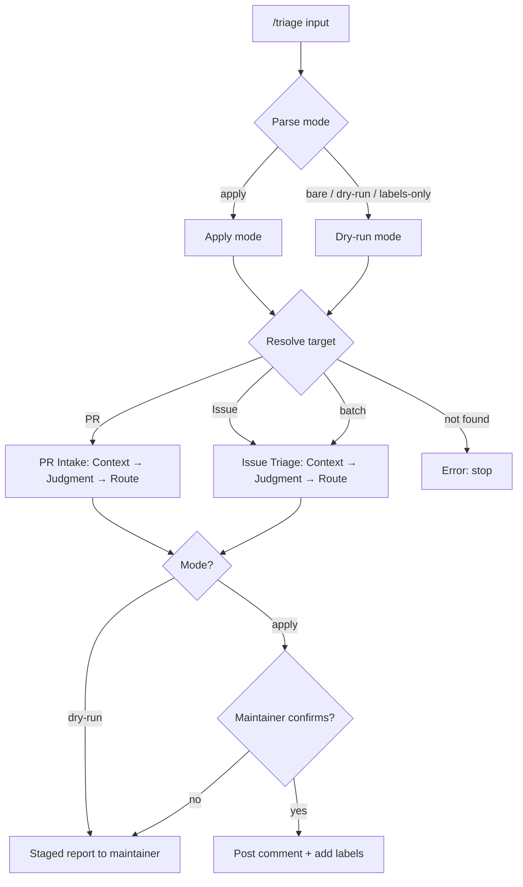
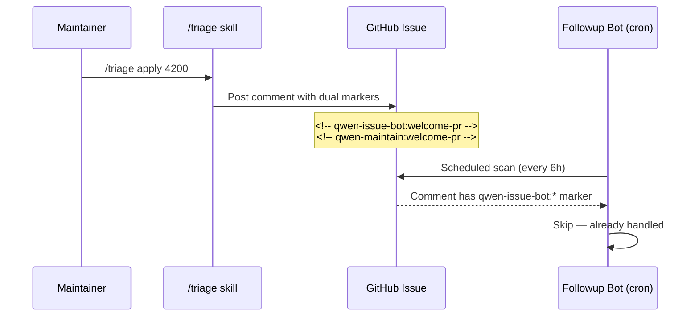

# Triage Workflow Overview

This document explains the architecture of the `triage` skill for future
maintenance. It is not the detailed rulebook; the detailed rules live in
`pr-intake-rules.md`, `issue-triage-rules.md`, and `tone-guide.md`.

## Contents

- Architecture
- Gate Model
- Main Flow
- Dry-Run Output
- PR Intake Boundaries
- Issue Triage Boundaries
- Historical Design Context
- Update Checklist

## Architecture

The skill has four layers:

| Layer         | Purpose                                                                | Files                              |
| ------------- | ---------------------------------------------------------------------- | ---------------------------------- |
| Entry router  | Resolve PR vs issue vs batch, enforce safety defaults                  | `SKILL.md`                         |
| PR intake     | Decide whether a PR is ready and directionally clear enough for review | `references/pr-intake-rules.md`    |
| Issue triage  | Classify, check completeness, diagnose only when evidence is enough    | `references/issue-triage-rules.md` |
| Communication | Keep comments warm, specific, and actionable                           | `references/tone-guide.md`         |

The core invariant is separation of responsibilities:

- PR intake is not deep code review.
- Issue label triage is not follow-up commenting.
- Follow-up comments are not label rewrites.
- Auto-fix routing asks whether to invoke `/qc bugfix`; it does not fix inside
  this skill.
- Historical closed PRs are design context, not automatic rejection signals.

## Gate Model

Use a compact three-gate model. A gate is a natural-language judgment over a
group of signals, not a single checkbox.

| Gate          | Question                                                  | Stops when                                                                                           | Continues when                                             |
| ------------- | --------------------------------------------------------- | ---------------------------------------------------------------------------------------------------- | ---------------------------------------------------------- |
| Context Gate  | What is this, and what are we allowed to do?              | Side effects are blocked by dry-run, prior handling, assignment, closed state, or marker             | Analysis can continue safely                               |
| Judgment Gate | Is it complete, directionally sound, and specific enough? | Missing facts, missing PR evidence, unclear product direction, weak diagnosis, or unreviewable scope | It is well-formed and has enough evidence                  |
| Route Gate    | What should happen next?                                  | The right answer is no-action, clarification, retest, related link, or maintainer discussion         | Handoff is justified to welcome-pr, bugfix, or code review |

The important rule: a stop at one gate is still a useful conclusion. Do not keep
digging just because more tools are available.

## Main Flow

### Marker Coordination

The triage skill and the automated followup bot both post comments on issues.
This diagram shows how dual markers prevent conflicting duplicate comments:

## Dry-Run Output

Dry-run output is a staged maintainer report, not just labels. The stages are
report sections for the three-gate model, not separate micro-gates. Existing
markers or substantive comments prevent duplicate side effects, but they do not
suppress analysis.

For issues, output:

| Stage                                   | Required content                                                                                                         |
| --------------------------------------- | ------------------------------------------------------------------------------------------------------------------------ |
| Stage 1: Intake Gate                    | state, prior handling markers/comments, whether side effects are blocked                                                 |
| Stage 2: Labels & Information           | current labels, label sanity, missing information, related/duplicate status                                              |
| Stage 3: Product Direction Or Diagnosis | feature direction, KISS path, overlap, implementation boundary, welcome-pr readiness; or bug evidence and diagnosis path |
| Stage 4: Route & Side Effects           | route plus `no-action`, label edit, or comment recommendation                                                            |

For PRs, output:

| Stage                              | Required content                                                           |
| ---------------------------------- | -------------------------------------------------------------------------- |
| Stage 1: Intake Gate               | PR state, draft status, author evidence locations, existing review context |
| Stage 2: Template & Evidence       | body completeness, validation evidence, intake stop conditions             |
| Stage 3: Product Direction & Scope | product fit, historical design context, size/split judgment                |
| Stage 4: Route & Side Effects      | next route, draft comment, and label plan                                  |

## PR Intake Boundaries

PR intake answers four questions:

| Question                                    | Output                                                  |
| ------------------------------------------- | ------------------------------------------------------- |
| Does the change fit Qwen Code direction?    | `aligned`, `discuss`, or `reject`                       |
| Is the PR body meaningful?                  | `complete` or `incomplete`                              |
| Is scope reviewable?                        | `focused`, `suggest-split`, or `oversized-acknowledged` |
| Did the author provide validation evidence? | `present` or `missing`                                  |

Do not inspect implementation correctness deeply here. If intake passes, the next
step is normal review, not merge approval.

## Issue Triage Boundaries

Issue triage always produces two separate plans:

| Plan           | Owns                                    |
| -------------- | --------------------------------------- |
| Label Plan     | Existing labels that route the issue    |
| Follow-up Plan | One conservative comment, or no comment |

The follow-up plan should be empty when prior handling already exists unless the
user explicitly asks for manual override. Prior handling means "do not duplicate
side effects"; it does not mean "stop dry-run analysis."

For feature requests, Stage 3 should be substantial enough to resemble a product
fit review:

| Check                | Output                                                                      |
| -------------------- | --------------------------------------------------------------------------- |
| Product fit          | `aligned`, `discuss`, or `reject`, with the concrete workflow problem       |
| KISS path            | Smallest viable implementation boundary                                     |
| Overlap              | Difference from existing commands, skills, roadmap items, or related issues |
| Welcome-PR readiness | Whether contribution is self-contained or needs maintainer design           |

## Historical Design Context

Closed PRs and old markdown design docs can be valuable. Use them to recover:

- problem framing;
- architecture constraints;
- tradeoffs;
- validation plans;
- unresolved questions.

Do not treat "closed" as "bad". Treat closed work as negative precedent only
when maintainers explicitly said the direction should not be pursued.

## Update Checklist

When changing this skill:

1. Keep `SKILL.md` as the routing and safety layer.
2. Put detailed PR rules in `pr-intake-rules.md`.
3. Put detailed issue rules in `issue-triage-rules.md`.
4. Put phrasing examples in `tone-guide.md`.
5. Verify any referenced label exists with `gh label list --repo QwenLM/qwen-code --limit 300`.
6. Smoke-test with `/triage dry-run <recent-issue-number>` to check the flow works end-to-end.
