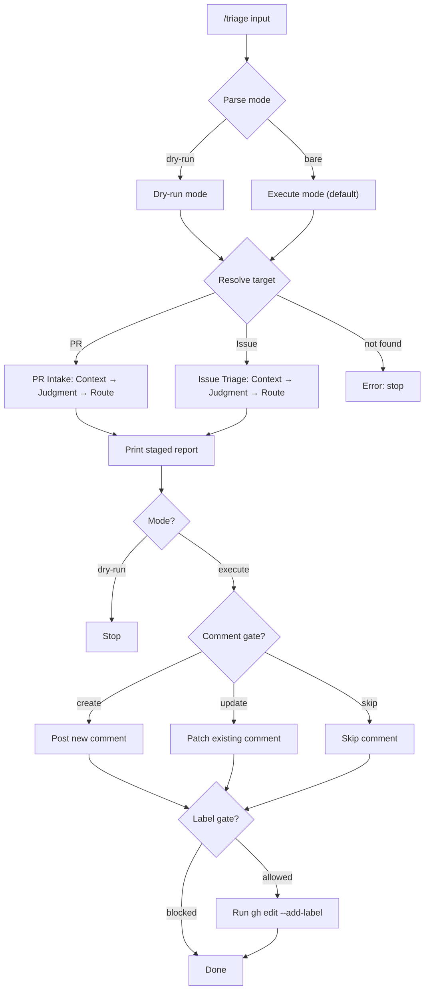
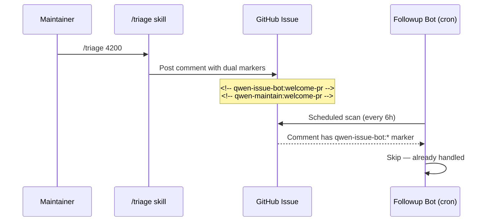

# Triage Workflow Overview

This document explains the architecture of the `triage` skill for future
maintenance. It is not the detailed rulebook; the detailed rules live in
`pr-intake-rules.md`, `issue-triage-rules.md`, and `tone-guide.md`.

## Contents

- Architecture
- Main Flow
- Marker Coordination
- Historical Design Context
- Update Checklist

## Architecture

The skill has four layers:

| Layer         | Purpose                                                                | Files                              |
| ------------- | ---------------------------------------------------------------------- | ---------------------------------- |
| Entry router  | Resolve PR vs issue, parse mode, enforce safety defaults               | `SKILL.md`                         |
| PR intake     | Decide whether a PR is ready and directionally clear enough for review | `references/pr-intake-rules.md`    |
| Issue triage  | Classify, check completeness, diagnose only when evidence is enough    | `references/issue-triage-rules.md` |
| Communication | Keep comments warm, specific, and actionable                           | `references/tone-guide.md`         |

The core invariant is separation of responsibilities:

- PR intake is not deep code review.
- Issue label triage is not follow-up commenting.
- Follow-up comments are not label rewrites.
- Auto-fix routing asks whether to invoke `/qc bugfix`; it does not fix inside
  this skill.
- Historical closed PRs are design context, not automatic rejection signals.

The detailed gate model, dry-run report stages, and intake/triage verdict
tables live in `SKILL.md` and the rule files. They are intentionally not
duplicated here.

## Main Flow

## Marker Coordination

The triage skill and the automated followup bot (`.github/workflows/qwen-issue-followup-bot.yml`)
both post comments on issues. Dual markers prevent conflicting duplicate
comments:

The followup bot's prompt has an explicit skip list that includes both
`qwen-issue-bot:*` and `qwen-maintain:*` markers. When changing the marker
namespace, update both this skill and the bot workflow's skip list.

## Historical Design Context

Closed PRs and old markdown design docs can be valuable. Use them to recover:

- problem framing;
- architecture constraints;
- tradeoffs;
- validation plans;
- unresolved questions.

Do not treat "closed" as "bad". Treat closed work as negative precedent only
when maintainers explicitly said the direction should not be pursued.

## Update Checklist

When changing this skill:

1. Keep `SKILL.md` as the routing and safety layer.
2. Put detailed PR rules in `pr-intake-rules.md`.
3. Put detailed issue rules in `issue-triage-rules.md`.
4. Put phrasing examples in `tone-guide.md`.
5. Verify any referenced label exists with `gh label list --repo QwenLM/qwen-code --limit 300`.
6. If marker namespaces change, update both this skill and
   `.github/workflows/qwen-issue-followup-bot.yml`.
7. Smoke-test with `/triage dry-run <recent-issue-number>` to check the flow
   works end-to-end without writing to GitHub.
